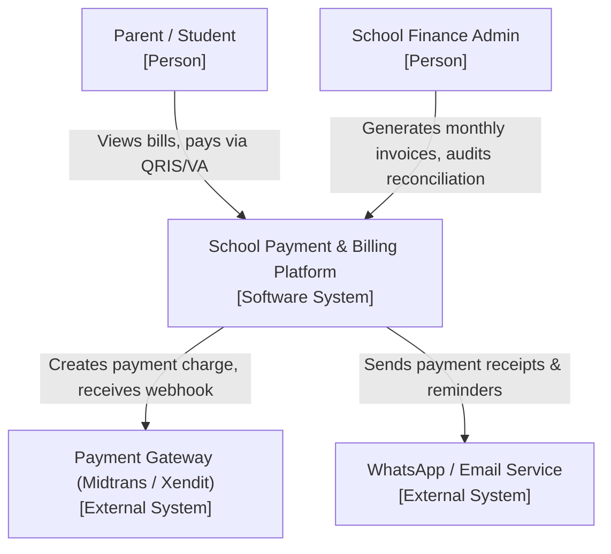
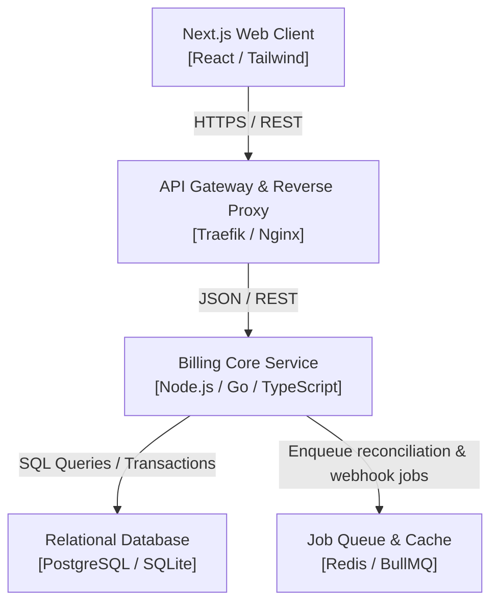

# C4 Architecture Model Template

## Level 1: System Context Diagram

```mermaid
graph TD
    Parent["Parent / Student<br/>[Person]"]
    Admin["School Finance Admin<br/>[Person]"]
    BillingSystem["School Payment & Billing Platform<br/>[Software System]"]
    PaymentGateway["Payment Gateway (Midtrans / Xendit)<br/>[External System]"]
    NotificationService["WhatsApp / Email Service<br/>[External System]"]

    Parent -->|"Views bills, pays via QRIS/VA"| BillingSystem
    Admin -->|"Generates monthly invoices, audits reconciliation"| BillingSystem
    BillingSystem -->|"Creates payment charge, receives webhook"| PaymentGateway
    BillingSystem -->|"Sends payment receipts & reminders"| NotificationService
```

## Level 2: Container Diagram

```mermaid
graph TD
    SPA["Next.js Web Client<br/>[React / Tailwind]"]
    APIGateway["API Gateway & Reverse Proxy<br/>[Traefik / Nginx]"]
    BillingService["Billing Core Service<br/>[Node.js / Go / TypeScript]"]
    PrimaryDB["Relational Database<br/>[PostgreSQL / SQLite]"]
    RedisQueue["Job Queue & Cache<br/>[Redis / BullMQ]"]

    SPA -->|"HTTPS / REST"| APIGateway
    APIGateway -->|"JSON / REST"| BillingService
    BillingService -->|"SQL Queries / Transactions"| PrimaryDB
    BillingService -->|"Enqueue reconciliation & webhook jobs"| RedisQueue
```
