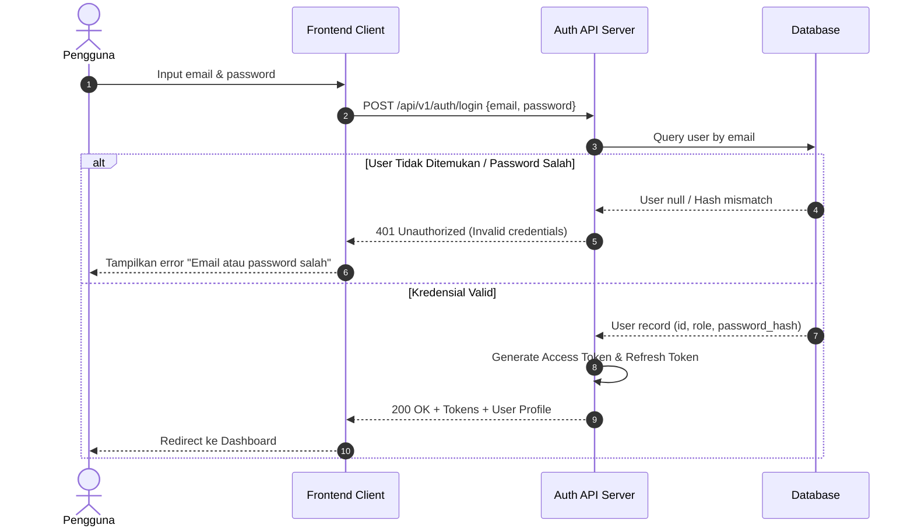

# 🔄 Workflows: Autentikasi Pengguna

```mermaid
sequenceDiagram
    autonumber
    actor User as Pengguna
    participant UI as Frontend Client
    participant API as Auth API Server
    participant DB as Database

    User->>UI: Input email & password
    UI->>API: POST /api/v1/auth/login {email, password}
    API->>DB: Query user by email
    alt User Tidak Ditemukan / Password Salah
        DB-->>API: User null / Hash mismatch
        API-->>UI: 401 Unauthorized (Invalid credentials)
        UI-->>User: Tampilkan error "Email atau password salah"
    else Kredensial Valid
        DB-->>API: User record (id, role, password_hash)
        API->>API: Generate Access Token & Refresh Token
        API-->>UI: 200 OK + Tokens + User Profile
        UI-->>User: Redirect ke Dashboard
    end
```
