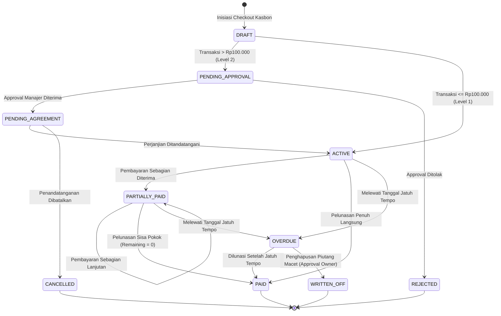

# 🔄 States & Transitions: FEAT-CREDIT-001

## 1. Siklus Status Piutang Kasbon (`customer_debts`)

```mermaid
stateDiagram-v2
    [*] --> DRAFT: Inisiasi Checkout Kasbon
    DRAFT --> PENDING_APPROVAL: Transaksi > Rp100.000 (Level 2)
    DRAFT --> ACTIVE: Transaksi <= Rp100.000 (Level 1)
    
    PENDING_APPROVAL --> PENDING_AGREEMENT: Approval Manajer Diterima
    PENDING_APPROVAL --> REJECTED: Approval Ditolak
    
    PENDING_AGREEMENT --> ACTIVE: Perjanjian Ditandatangani
    PENDING_AGREEMENT --> CANCELLED: Penandatanganan Dibatalkan
    
    ACTIVE --> PARTIALLY_PAID: Pembayaran Sebagian Diterima
    PARTIALLY_PAID --> PARTIALLY_PAID: Pembayaran Sebagian Lanjutan
    PARTIALLY_PAID --> PAID: Pelunasan Sisa Pokok (Remaining = 0)
    ACTIVE --> PAID: Pelunasan Penuh Langsung
    
    ACTIVE --> OVERDUE: Melewati Tanggal Jatuh Tempo
    PARTIALLY_PAID --> OVERDUE: Melewati Tanggal Jatuh Tempo
    
    OVERDUE --> PAID: Dilunasi Setelah Jatuh Tempo
    OVERDUE --> WRITTEN_OFF: Penghapusan Piutang Macet (Approval Owner)

    PAID --> [*]
    REJECTED --> [*]
    CANCELLED --> [*]
    WRITTEN_OFF --> [*]
```
