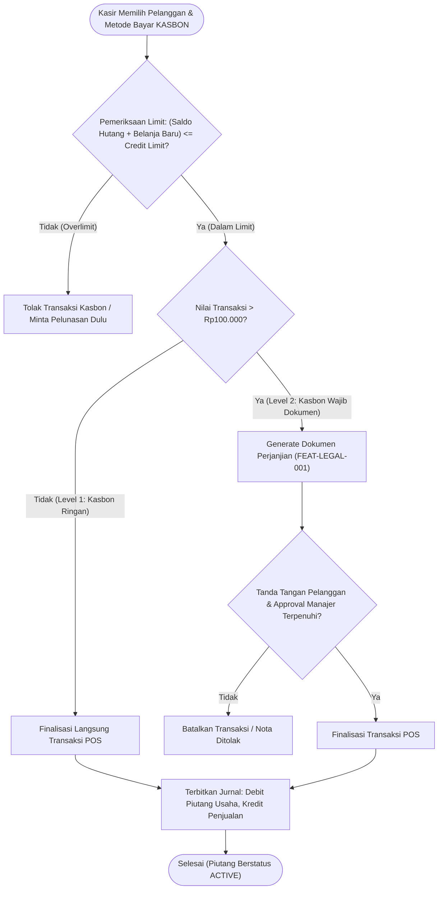
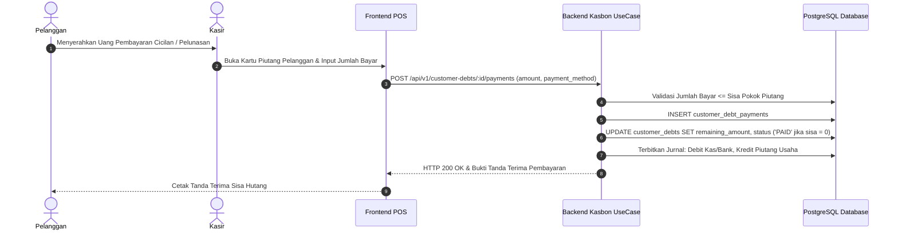

# 🔄 Workflows: FEAT-CREDIT-001

## 1. Alur Pengajuan Kasbon Berjenjang

```mermaid
flowchart TD
    Start(["Kasir Memilih Pelanggan & Metode Bayar KASBON"]) --> CheckLimit{"Pemeriksaan Limit: (Saldo Hutang + Belanja Baru) <= Credit Limit?"}
    
    CheckLimit -- "Tidak (Overlimit)" --> RejectOver["Tolak Transaksi Kasbon / Minta Pelunasan Dulu"]
    CheckLimit -- "Ya (Dalam Limit)" --> CheckVal{"Nilai Transaksi > Rp100.000?"}
    
    CheckVal -- "Tidak (Level 1: Kasbon Ringan)" --> Finalize1["Finalisasi Langsung Transaksi POS"]
    CheckVal -- "Ya (Level 2: Kasbon Wajib Dokumen)" --> GenDoc["Generate Dokumen Perjanjian (FEAT-LEGAL-001)"]
    
    GenDoc --> SignAndApprove{"Tanda Tangan Pelanggan & Approval Manajer Terpenuhi?"}
    SignAndApprove -- "Tidak" --> Abort["Batalkan Transaksi / Nota Ditolak"]
    SignAndApprove -- "Ya" --> Finalize2["Finalisasi Transaksi POS"]
    
    Finalize1 --> Acc["Terbitkan Jurnal: Debit Piutang Usaha, Kredit Penjualan"]
    Finalize2 --> Acc
    Acc --> End(["Selesai (Piutang Berstatus ACTIVE)"])
```

## 2. Alur Pembayaran Cicilan & Pelunasan

```mermaid
sequenceDiagram
    autonumber
    actor Pelanggan
    actor Kasir
    participant POS as Frontend POS
    participant BE as Backend Kasbon UseCase
    participant DB as PostgreSQL Database

    Pelanggan->>Kasir: Menyerahkan Uang Pembayaran Cicilan / Pelunasan
    Kasir->>POS: Buka Kartu Piutang Pelanggan & Input Jumlah Bayar
    POS->>BE: POST /api/v1/customer-debts/:id/payments (amount, payment_method)
    BE->>DB: Validasi Jumlah Bayar <= Sisa Pokok Piutang
    BE->>DB: INSERT customer_debt_payments
    BE->>DB: UPDATE customer_debts SET remaining_amount, status ('PAID' jika sisa = 0)
    BE->>DB: Terbitkan Jurnal: Debit Kas/Bank, Kredit Piutang Usaha
    BE-->>POS: HTTP 200 OK & Bukti Tanda Terima Pembayaran
    POS-->>Pelanggan: Cetak Tanda Terima Sisa Hutang
```
