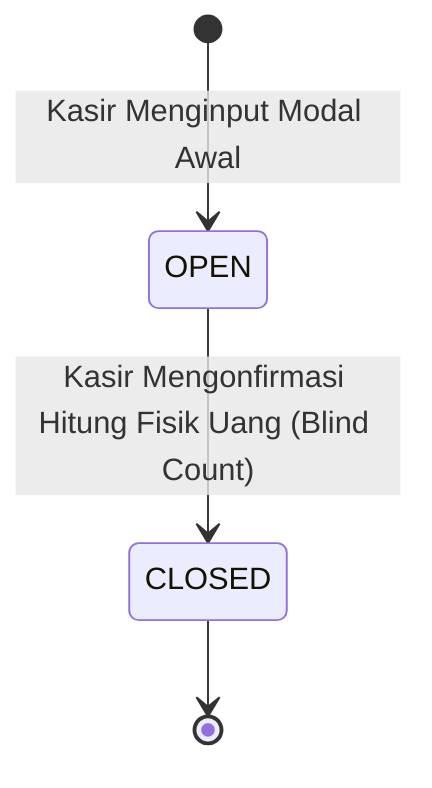
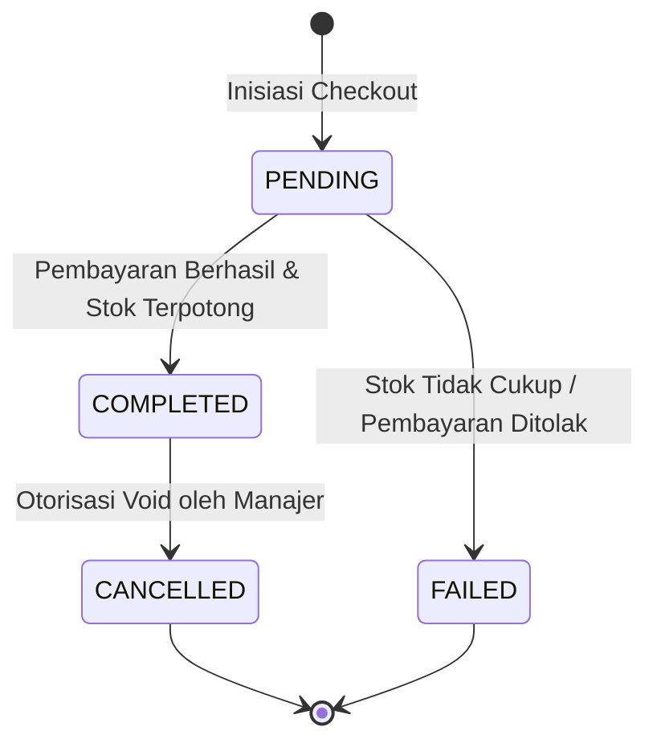

# 🔄 States & Transitions: FEAT-POS-001

## 1. Siklus Status Shift Kasir (`cashier_shift_logs`)

```mermaid
stateDiagram-v2
    [*] --> OPEN: Kasir Menginput Modal Awal
    OPEN --> CLOSED: Kasir Mengonfirmasi Hitung Fisik Uang (Blind Count)
    CLOSED --> [*]
```

## 2. Siklus Status Transaksi Penjualan (`transactions`)

```mermaid
stateDiagram-v2
    [*] --> PENDING: Inisiasi Checkout
    PENDING --> COMPLETED: Pembayaran Berhasil & Stok Terpotong
    PENDING --> FAILED: Stok Tidak Cukup / Pembayaran Ditolak
    COMPLETED --> CANCELLED: Otorisasi Void oleh Manajer
    CANCELLED --> [*]
    FAILED --> [*]
```
