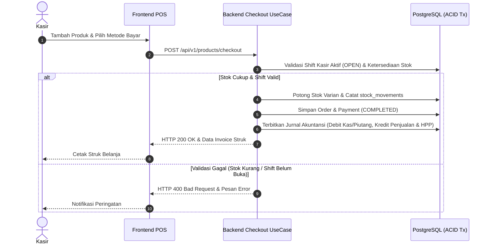
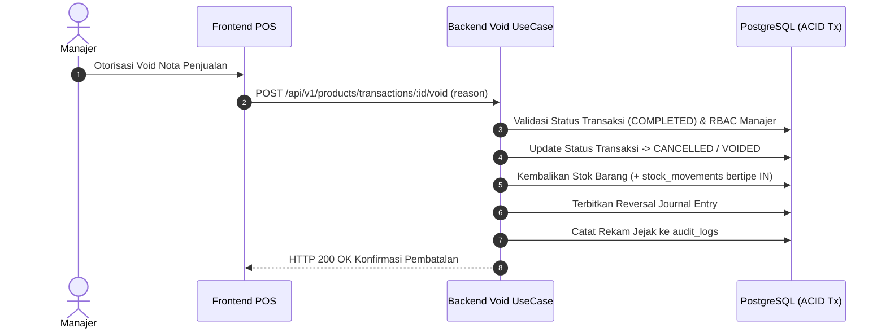

# 🔄 Workflows: FEAT-POS-001

## 1. Alur Checkout Transaksi Penjualan

```mermaid
sequenceDiagram
    autonumber
    actor Kasir
    participant POS as Frontend POS
    participant BE as Backend Checkout UseCase
    participant DB as PostgreSQL (ACID Tx)

    Kasir->>POS: Tambah Produk & Pilih Metode Bayar
    POS->>BE: POST /api/v1/products/checkout
    BE->>DB: Validasi Shift Kasir Aktif (OPEN) & Ketersediaan Stok
    
    alt Stok Cukup & Shift Valid
        BE->>DB: Potong Stok Varian & Catat stock_movements
        BE->>DB: Simpan Order & Payment (COMPLETED)
        BE->>DB: Terbitkan Jurnal Akuntansi (Debit Kas/Piutang, Kredit Penjualan & HPP)
        BE-->>POS: HTTP 200 OK & Data Invoice Struk
        POS-->>Kasir: Cetak Struk Belanja
    else Validasi Gagal (Stok Kurang / Shift Belum Buka)
        BE-->>POS: HTTP 400 Bad Request & Pesan Error
        POS-->>Kasir: Notifikasi Peringatan
    end
```

## 2. Alur Pembatalan Transaksi (Void)

```mermaid
sequenceDiagram
    autonumber
    actor Manajer
    participant POS as Frontend POS
    participant BE as Backend Void UseCase
    participant DB as PostgreSQL (ACID Tx)

    Manajer->>POS: Otorisasi Void Nota Penjualan
    POS->>BE: POST /api/v1/products/transactions/:id/void (reason)
    BE->>DB: Validasi Status Transaksi (COMPLETED) & RBAC Manajer
    BE->>DB: Update Status Transaksi -> CANCELLED / VOIDED
    BE->>DB: Kembalikan Stok Barang (+ stock_movements bertipe IN)
    BE->>DB: Terbitkan Reversal Journal Entry
    BE->>DB: Catat Rekam Jejak ke audit_logs
    BE-->>POS: HTTP 200 OK Konfirmasi Pembatalan
```
