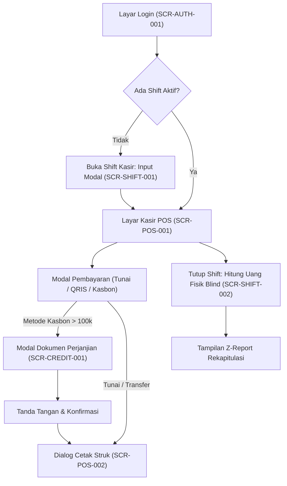

# 📱 Ikhtisar Prototype & Alur Pengujian Interaktif

Dokumen ini memetakan alur navigasi antar layar pada prototype frontend KasirSakti.

---

## Peta Alur Navigasi Antarmuka

```mermaid
flowchart TD
    Login["Layar Login (SCR-AUTH-001)"] --> ShiftCheck{"Ada Shift Aktif?"}
    ShiftCheck -- "Tidak" --> OpenShift["Buka Shift Kasir: Input Modal (SCR-SHIFT-001)"]
    ShiftCheck -- "Ya" --> POS["Layar Kasir POS (SCR-POS-001)"]
    OpenShift --> POS
    
    POS --> PaymentModal["Modal Pembayaran (Tunai / QRIS / Kasbon)"]
    PaymentModal -- "Metode Kasbon > 100k" --> AgreementModal["Modal Dokumen Perjanjian (SCR-CREDIT-001)"]
    AgreementModal --> SignFlow["Tanda Tangan & Konfirmasi"]
    SignFlow --> SuccessReceipt["Dialog Cetak Struk (SCR-POS-002)"]
    PaymentModal -- "Tunai / Transfer" --> SuccessReceipt
    
    POS --> CloseShift["Tutup Shift: Hitung Uang Fisik Blind (SCR-SHIFT-002)"]
    CloseShift --> ZReport["Tampilan Z-Report Rekapitulasi"]
```
