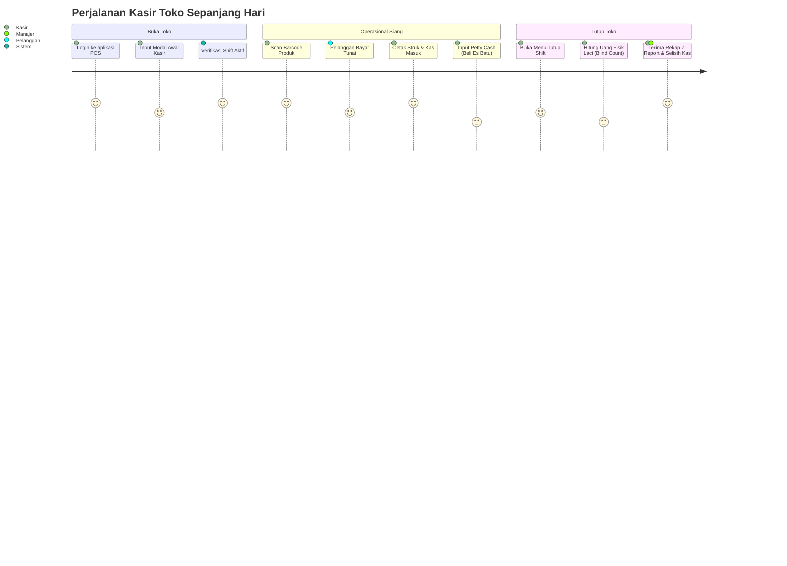

# 🚶 User Journey: Pelayanan Kasir Toko & Penutupan Shift

```mermaid
journey
    title Perjalanan Kasir Toko Sepanjang Hari
    section Buka Toko
      Login ke aplikasi POS: 5: Kasir
      Input Modal Awal Kasir: 4: Kasir
      Verifikasi Shift Aktif: 5: Sistem
    section Operasional Siang
      Scan Barcode Produk: 5: Kasir
      Pelanggan Bayar Tunai: 4: Pelanggan
      Cetak Struk & Kas Masuk: 5: Kasir
      Input Petty Cash (Beli Es Batu): 3: Kasir
    section Tutup Toko
      Buka Menu Tutup Shift: 4: Kasir
      Hitung Uang Fisik Laci (Blind Count): 3: Kasir
      Terima Rekap Z-Report & Selisih Kas: 5: Kasir, Manajer
```
