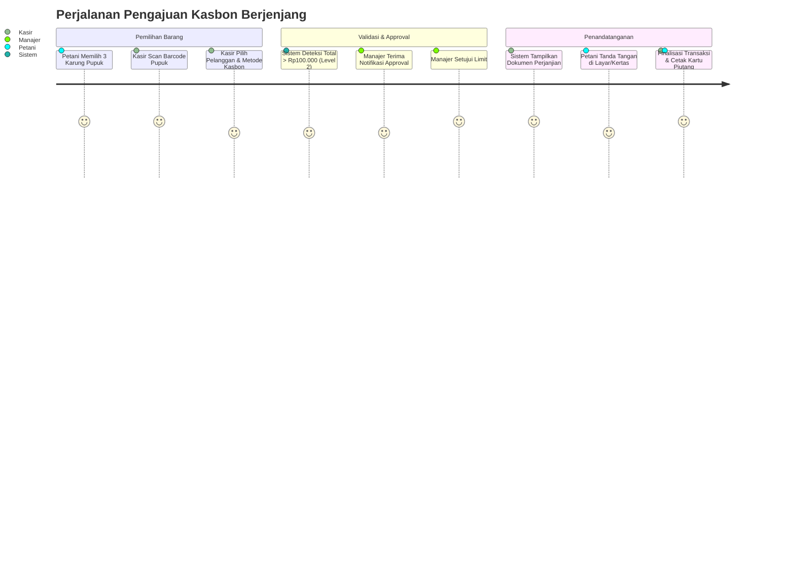

# 🚶 User Journey: Pengajuan & Approval Kasbon Pertanian

```mermaid
journey
    title Perjalanan Pengajuan Kasbon Berjenjang
    section Pemilihan Barang
      Petani Memilih 3 Karung Pupuk: 5: Petani
      Kasir Scan Barcode Pupuk: 5: Kasir
      Kasir Pilih Pelanggan & Metode Kasbon: 4: Kasir
    section Validasi & Approval
      Sistem Deteksi Total > Rp100.000 (Level 2): 4: Sistem
      Manajer Terima Notifikasi Approval: 4: Manajer
      Manajer Setujui Limit: 5: Manajer
    section Penandatanganan
      Sistem Tampilkan Dokumen Perjanjian: 5: Kasir
      Petani Tanda Tangan di Layar/Kertas: 4: Petani
      Finalisasi Transaksi & Cetak Kartu Piutang: 5: Kasir, Petani
```
