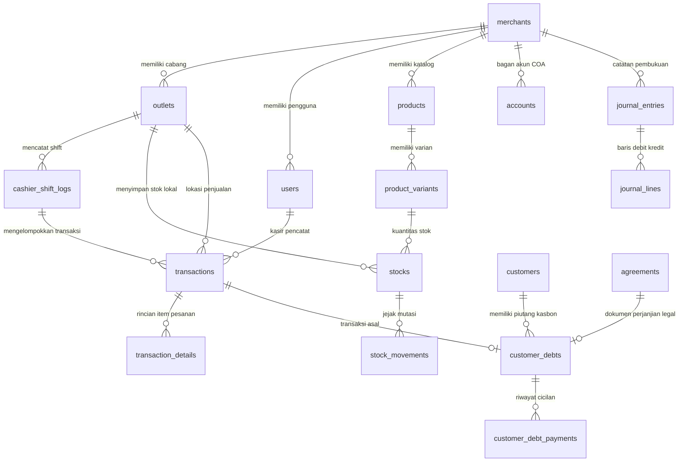

# 🗄️ Entity Relationship Diagram (ERD) — KasirSakti Database

Dokumen ini memetakan relasi antar entitas inti dalam skema basis data PostgreSQL KasirSakti.

---

## Diagram Relasi Entitas

```mermaid
erDiagram
    merchants ||--o{ outlets : "memiliki cabang"
    merchants ||--o{ users : "memiliki pengguna"
    outlets ||--o{ cashier_shift_logs : "mencatat shift"
    outlets ||--o{ stocks : "menyimpan stok lokal"
    
    merchants ||--o{ products : "memiliki katalog"
    products ||--o{ product_variants : "memiliki varian"
    product_variants ||--o{ stocks : "kuantitas stok"
    stocks ||--o{ stock_movements : "jejak mutasi"
    
    cashier_shift_logs ||--o{ transactions : "mengelompokkan transaksi"
    users ||--o{ transactions : "kasir pencatat"
    outlets ||--o{ transactions : "lokasi penjualan"
    transactions ||--o{ transaction_details : "rincian item pesanan"
    
    customers ||--o{ customer_debts : "memiliki piutang kasbon"
    transactions ||--o| customer_debts : "transaksi asal"
    customer_debts ||--o{ customer_debt_payments : "riwayat cicilan"
    agreements ||--o| customer_debts : "dokumen perjanjian legal"
    
    merchants ||--o{ accounts : "bagan akun COA"
    merchants ||--o{ journal_entries : "catatan pembukuan"
    journal_entries ||--o{ journal_lines : "baris debit kredit"
```
